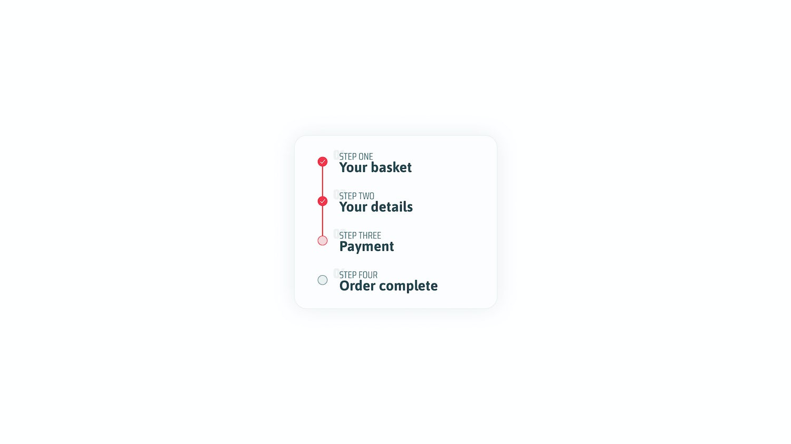

# Primera Frontend Assessment

Follow the instruction in the provided assessment below 


### CHALLENGE: Progress Stepper 

Showing progress visually is very handy in UI design, but it’s even more important to make sure that it’s implemented semantically too. 
In this challenge, that’s the goal!

### What you’re building

 


### The brief

Take the design assets and build a progress stepper component, using react. 
You should aim for the following, at a minimum:

* Your solution uses semantic HTML
* Your solution could work with a handful of items or a lot of items
* Long items and short items should work harmoniously

Implement the attached screenshots design using React + TypeScript + Vite + Scss + TailwindCSS.

### Assets

I’ve used Figma to design this challenge. [You can view everything you need in the browser, here](https://www.figma.com/file/R0WkFubht6lAjY1soVeaLW/Challenge-008?node-id=0%3A1).

Here’s some assets to get you going:

* [Figma Prototype](https://www.figma.com/file/R0WkFubht6lAjY1soVeaLW/Challenge-008?node-id=0%3A1)

* [PDF Version](https://hankchizljaw.s3.amazonaws.com/fecc-challenge-008.pdf)

* [Saira Condensed font](https://fonts.google.com/specimen/Saira+Condensed)

* [Asap font](https://fonts.google.com/specimen/Asap)


> NOTE: 

* The project is already setup with React + TypeScript + Vite + Scss + TailwindCSS. 
All you've to do is focus on achieving the implementation as seen on the attached document.

* This assessment takes maximum of 2 hours for completion. Simply pay attention to the instruction detail. 

* Update pushed to the GitHub repository after the assessment time elapse will make you to be disqualified. 

* For icons use the flutter built-in material design icon set e.g., Icon(Icons.add). 
These icons might not fit in to what is in the design but the focus is for you to achieve the basic requirement.


Here are some CSS Custom Properties for your tokens and treatments:

```
:root {
  --color-light: #fdfdfd;
  --color-dark: #27474e;
  --color-mid: #496970;
  --color-primary: #f3344a;
  --color-primary-glare: #f4d7da;
  --color-secondary: #678c94;
  --color-secondary-glare: #ebf0f1;
  --shadow: 0px 0px 40px rgba(39, 71, 78, 0.1);
}
```

### AREAS WE ARE LOOKING OUT FOR 
* Attention to instruction detail
* Code structuring 
* Reusable component 
* Proper use of hooks where applicable 

### Candidate Info
> Replace the placeholder information with your name and email.

Canditate Name: 
e.g John Doe

Candidate Email: 
e.g johndoe@example.com

...

This template provides a minimal setup to get React working in Vite with HMR and some ESLint rules.

Currently, two official plugins are available:

- [@vitejs/plugin-react](https://github.com/vitejs/vite-plugin-react/blob/main/packages/plugin-react/README.md) uses [Babel](https://babeljs.io/) for Fast Refresh
- [@vitejs/plugin-react-swc](https://github.com/vitejs/vite-plugin-react-swc) uses [SWC](https://swc.rs/) for Fast Refresh

## Expanding the ESLint configuration

If you are developing a production application, we recommend updating the configuration to enable type aware lint rules:

- Configure the top-level `parserOptions` property like this:

```js
   parserOptions: {
    ecmaVersion: 'latest',
    sourceType: 'module',
    project: ['./tsconfig.json', './tsconfig.node.json'],
    tsconfigRootDir: __dirname,
   },
```

- Replace `plugin:@typescript-eslint/recommended` to `plugin:@typescript-eslint/recommended-type-checked` or `plugin:@typescript-eslint/strict-type-checked`
- Optionally add `plugin:@typescript-eslint/stylistic-type-checked`
- Install [eslint-plugin-react](https://github.com/jsx-eslint/eslint-plugin-react) and add `plugin:react/recommended` & `plugin:react/jsx-runtime` to the `extends` list
